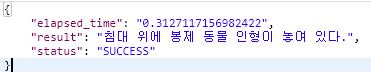

# MMCaptioning

## Introduction
MMCaptioning is image captioning project based on [OpenMMLab](https://openmmlab.com) [MMDetection](https://github.com/open-mmlab/mmdetection) framework, stems from the codebase developed by the *MMDet* team, who won [COCO Detection Challenge](http://cocodataset.org/#detection-leaderboard) in 2018.

### Major features
- **Modular Design**
  Like the MMDetection framework, I decompose the captioning framework into different components and one can easily construct a customized image captioning framework by combining different modules.

- **Support of multiple image feature extractors**
  The toolbox directly supports popular image feature extractors, *e.g.* ResNet, Res2Net, Resnext, etc.

## License
This project is released under the [Apache 2.0 license](LICENSE).
